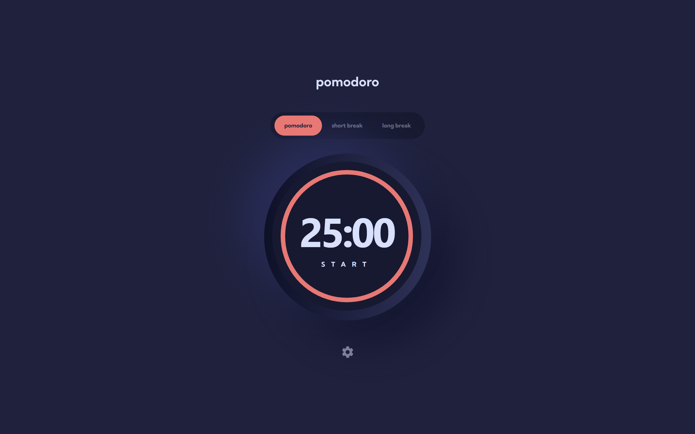

# Pomodoro Timer App

A simple and effective Pomodoro timer app built with React, TypeScript, and Vite. Boost your productivity by managing your work and break intervals, tracking your focus, and staying organized.



## Tech Stack

- **React** — UI library
- **Vite** — Fast build tool
- **TypeScript** — Type safety
- **Zustand** — State management
- **Framer Motion / motion-plus** — Animations
- **Tailwind CSS** — Styling

## Features

- Pomodoro, short break, and long break modes
- Customizable timer durations
- Animated timer display
- Responsive and modern UI
- Keyboard accessible
- SEO optimized

## Getting Started

### Installation

```bash
npm install
```

### Running the App

```bash
npm run dev
```

Open [http://localhost:5173](http://localhost:5173) to view it in your browser.

## Project Structure

- `src/components/Timer` — Main timer logic and display
- `src/components/TimerSettings` — Timer settings and customization
- `src/store/pomodoroStore.ts` — Global state management (Zustand)
- `public/` — Static assets and icons

## Customization

- Change timer durations in the settings panel
- Switch between Pomodoro, short break, and long break tabs
- Choose your preferred font and color theme

## SEO

This app includes SEO meta tags for better search engine visibility and social sharing. You can further customize them in `index.html`.

## License

MIT
